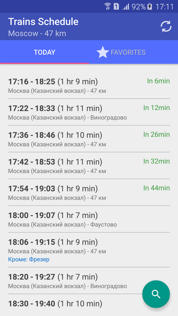

# Trains Schedule

## About 
- This thing planned as Xamarin Forms app to show schedule of suburban electric trains using [Yandex API][yandex].

- My idea is research the process of quick porting of Android application to XF. 

## Screenshots (design)

## Status
- Damaged / Draft / Init state of app porting process

## Used libraries
* Robospice - library for building network async apps  
* Retrofit - library for working with REST API

## References
- https://github.com/Rexee/TrainsSchedule "Original Java Version"
- https://tech.yandex.ru/rasp/raspapi "Yandex API"
- https://github.com/stephanenicolas/robospice "Robospice"
- http://square.github.io/retrofit "Retrofit"

## ..
As is. No support. RnD only.

## .
[m][e] 2023
